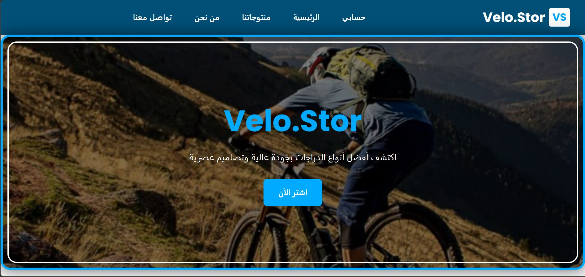
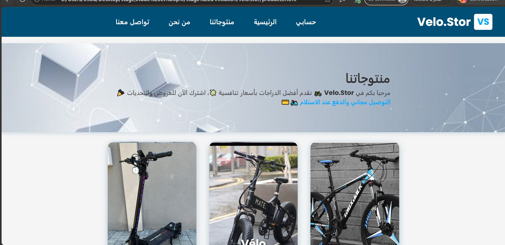
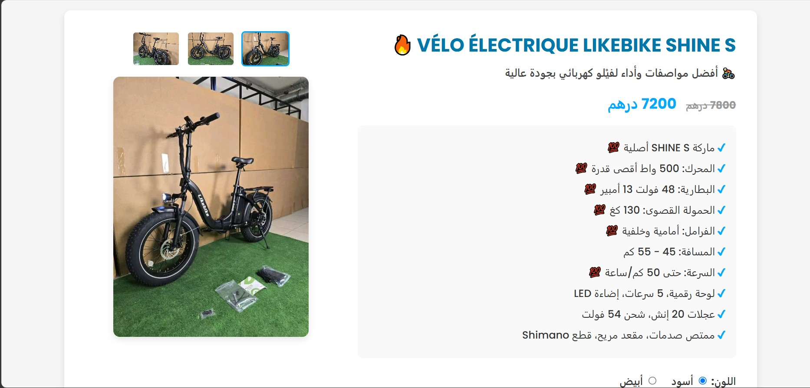
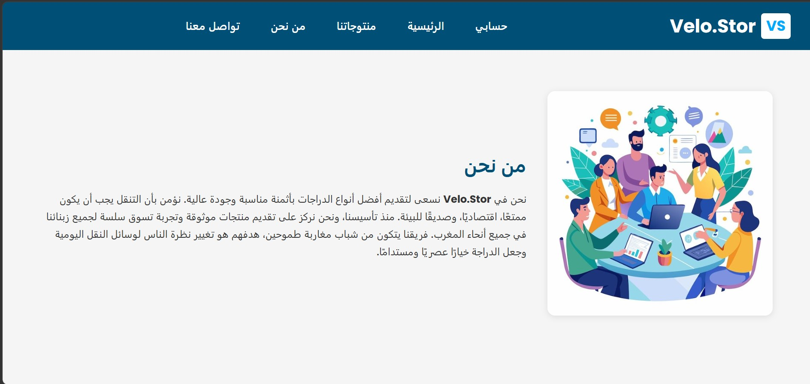
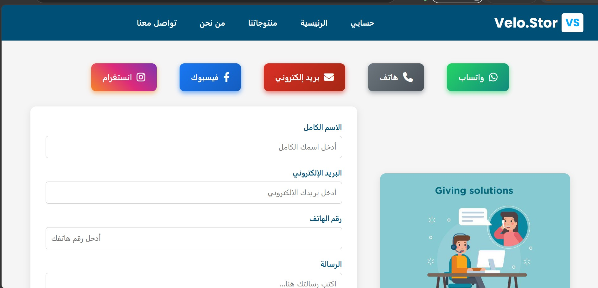

# VELO STOR – Online Store 

VELO STOR is an online store project developed for learning and technical experimentation around e-commerce, product presentation, and user experience.

This project is directly linked to a WhatsApp bot, allowing users to interact with the store via WhatsApp to browse products, get information, and simulate an automated customer journey.

## 📸 Screenshots

  
  

  
  

  

👉 **[View all screenshots](./screenshots)**

## 🔗 WhatsApp Bot Integration

The VELO STOR store is connected to a WhatsApp bot developed in Python using the official Meta WhatsApp Cloud API.

- **👉 WhatsApp bot project link:**
https://github.com/Nexus-Vertex/Meta-API-python-whatsapp-bot

### The bot provides features such as:
- **Product presentation from the store**
- **Navigation through a conversational logic**
- **Automation of customer responses**
- **Simulation of a customer service experience via WhatsApp**

## 🎯 Project Goal

### This project aims to:
- **Understand the operation of an online store**
- **Test the integration between an e-commerce site and a WhatsApp bot**
- **Apply backend logic, automation, and user journey concepts**
- **Experiment with a conversational commerce approach**
- **The products shown are used only for testing and demonstration purposes.**

## 🛠️ Technologies Used
- **HTML / CSS / JavaScript (frontend)**
- **Python (WhatsApp bot)**
- **Meta WhatsApp Cloud API**
- **Flask (backend of the bot)**
- **Git & GitHub**

## Hinweis
Dieses Projekt wurde eigenständig entwickelt, um grundlegende Kenntnisse in den Bereichen Webentwicklung, Python, APIs, WhatsApp-Integration und Backend-Logik zu demonstrieren.

Der Fokus liegt auf der Verständnis technischer Konzepte, sauberer Projektstruktur und nachvollziehbarer Implementierung – Kompetenzen, die besonders relevant für eine Ausbildung im Bereich Fachinformatik / Anwendungsentwicklung sind.

Dieses Repository dient als praktischer Nachweis meiner Motivation, Lernbereitschaft und technischen Grundlagen.

## This project is part of a series of practical experiments, including:
- **WhatsApp AI Bot:** 👉 https://github.com/Nexus-Vertex/Meta-API-python-whatsapp-bot
- **Anomaly Detection Program:** 👉 https://github.com/Nexus-Vertex/Anomaly-Detection-System

## 👤 Author
- GitHub : [@Nexus-Vertex](https://github.com/Nexus-Vertex)
- Email : leilaeltousy@gmail.com

---
## 📝 License
This project is shared for educational and portfolio purposes.

---
⭐ If you find this project useful, feel free to give it a star!
